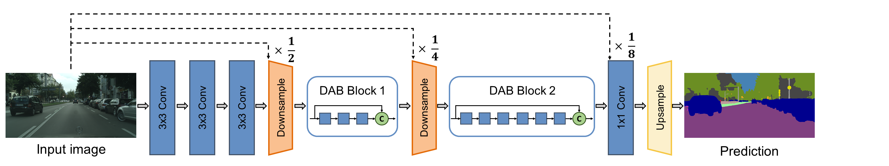

# DABNet: Depth-wise Asymmetric Bottleneck for Real-time Semantic Segmentation
This project contains the Pytorch implementation for the proposed DABNet: [[arXiv]](https://arxiv.org/abs/1907.11357).

### Introduction
<p align="center"></p>

As a pixel-level prediction task, semantic segmentation needs large computational cost with enormous parameters to obtain high performance. Recently, due to the increasing demand for autonomous systems and robots, it is significant to make a tradeoff between accuracy and inference speed. In this paper, we propose a novel Depthwise Asymmetric Bottleneck (DAB) module to address this dilemma, which efficiently adopts depth-wise asymmetric convolution and dilated convolution to build a bottleneck structure. Based on the DAB module, we design a Depth-wise Asymmetric Bottleneck Network (DABNet) especially for real-time semantic segmentation, which creates sufficient receptive field and densely utilizes the contextual information. Experiments on Cityscapes and CamVid datasets demonstrate that the proposed DABNet achieves a balance between speed and precision. Specifically, without any pretrained model and postprocessing, it achieves 70.1% Mean IoU on the Cityscapes test dataset with only 0.76 million parameters and a speed of 104 FPS on a single GTX 1080Ti card.

### Installation
- Env: Python 3.6; PyTorch 1.0; CUDA 9.0; cuDNN V7
- Install some packages
```
pip install opencv-python pillow numpy matplotlib 
```
- Clone this repository
```
git clone https://github.com/Reagan1311/DABNet
cd DABNet
```
- One GPU with 11GB is needed

### Dataset
You need to download the two dataset——CamVid and Cityscapes, and put the files in the `dataset` folder with following structure.
```
├── camvid
|    ├── train
|    ├── test
|    ├── val 
|    ├── trainannot
|    ├── testannot
|    ├── valannot
|    ├── camvid_trainval_list.txt
|    ├── camvid_train_list.txt
|    ├── camvid_test_list.txt
|    └── camvid_val_list.txt
├── cityscapes
|    ├── gtCoarse
|    ├── gtFine
|    ├── leftImg8bit
|    ├── cityscapes_trainval_list.txt
|    ├── cityscapes_train_list.txt
|    ├── cityscapes_test_list.txt
|    └── cityscapes_val_list.txt           
```

### Training

- You can run: `python train.py -h` to check the detail of optional arguments.
Basically, in the `train.py`, you can set the dataset, train type, epochs and batch size, etc.
```
python train.py --dataset ${camvid, cityscapes} --train_type ${train, trainval} --max_epochs ${EPOCHS} --batch_size ${BATCH_SIZE} --lr ${LR} --resume ${CHECKPOINT_FILE}
```
- training on Cityscapes train set
```
python train.py --dataset cityscapes
```
- training on CamVid train and val set
```
python train.py --dataset camvid --train_type trainval --max_epochs 1000 --lr 1e-3 --batch_size 16
```
- During training course, every 50 epochs, we will record the mean IoU of train set, validation set and training loss to draw a plot, so you can check whether the training process is normal.

Val mIoU vs Epochs            |  Train loss vs Epochs
:-------------------------:|:-------------------------:
  |  

(PS: Based on the graphs, we think that training is not saturated yet, maybe the LR is too large, so you can change the hyper-parameter to get better result)

### Testing
- After training, the checkpoint will be saved at `checkpoint` folder, you can use `test.py` to get the result.
```
python test.py --dataset ${camvid, cityscapes} --checkpoint ${CHECKPOINT_FILE}
```
### Evaluation
- For those dataset that do not provide label on the test set (e.g. Cityscapes), you can use `predict.py` to save all the output images, then submit to official webpage for evaluation.
```
python predict.py --checkpoint ${CHECKPOINT_FILE}
```


### Inference Speed
- You can run the `eval_fps.py` to test the model inference speed, input the image size such as `512,1024`.
```
python eval_fps.py 512,1024
```

### Results

- quantitative results:

|Dataset|Pretrained|Train type|mIoU|FPS|model|
|:-:|:-:|:-:|:-:|:-:|:-:|
|Cityscapes(Fine)|from scratch|trainval|**70.07​%**|104|[Detailed result](https://www.cityscapes-dataset.com/anonymous-results/?id=16896cc219a6d5af875f8aa3d528a0f7c4ce57644aece957938eae9062ed8070)|
|Cityscapes(Fine)|from scratch|train|**69.57​%**|104|[GoogleDrive](https://drive.google.com/open?id=1ZKGBQogSqxyKD-QIJgzyDXw2TR0HUePA)|
|CamVid|from scratch|trainval|**66.72​%**|146|[GoogleDrive](https://drive.google.com/open?id=1EPyv9-FUQwr_23w3kLwwiFKD13uRyFRk)|

- qualitative segmentation examples:

<p align="center"></p>

### Citation

Please consider citing the [DABNet](https://arxiv.org/abs/1907.11357) if it's helpful for your research.
```
@inproceedings{li2019dabnet,
  title={DABNet: Depth-wise Asymmetric Bottleneck for Real-time Semantic Segmentation},
  author={Li, Gen and Kim, Joongkyu},
  booktitle={British Machine Vision Conference},
  year={2019}
}
```
### Thanks to the Third Party Libs
[Pytorch](https://github.com/pytorch/pytorch)  
[Pytorch-Deeplab](https://github.com/speedinghzl/Pytorch-Deeplab)  
[ERFNet](https://github.com/Eromera/erfnet_pytorch)  
[CGNet](https://github.com/wutianyiRosun/CGNet)  
